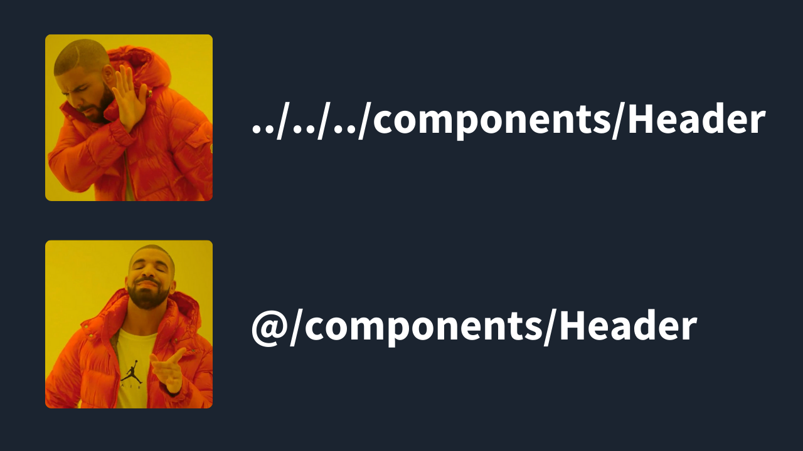

React uygulamaları büyüdükçe proje içindeki dosya ve klasörlere erişmekte oldukça zorlanabiliyoruz. Özellikle birbirinden bağımsız dosyalara erişmek istediğimizde kullanacağımız dosyanın kaç üst veya kaç alt klasörde olduğunu bilmek hem zaman kaybına yol açıp hem de hata oranını arttırabiliyor. Aşağıda bıraktığım kod örneğine bakarak ne demeye çalıştığımı anlayabilirsiniz.

~~~js title="Header.jsx"
import { getUserInfo } from '../../../../../utils/getUserInfo'
import SearchBar from '../../../components/SearchBar'
import Logo from '../../../../../../assets/images/logo.svg'

// ...
~~~

`<Header />` component'inde kullanacağımız bir logoyu tam altı seviye üste çıkarak `import` edebildik. İşte tam bu noktada **absolute imports** kullanarak import'larımızı aşağıdaki gibi hem temiz hem de basit hale getirebiliriz.

~~~js title="Header.jsx"
import { getUserInfo } from 'utils/getUserInfo'
import SearchBar from 'components/SearchBar'
import Logo from 'assets/images/logo.svg'

// veya

import { getUserInfo } from '@/utils/getUserInfo'
import SearchBar from '@/components/SearchBar'
import Logo from '@/assets/images/logo.svg'

// veya

import { getUserInfo } from '~/utils/getUserInfo'
import SearchBar from '~/components/SearchBar'
import Logo from '~/assets/images/logo.svg'
~~~

## Absolute Imports Nedir?

Klasör yollarınıza takma adlar vererek proje dosyalarına daha kolay ulaşabilmeyi sağlayan yöntemdir. Bu yöntemi uygulamak projenizi oluşturduğunuz altyapıya göre farklılık gösterse de oldukça kolay bir şekilde ayarlayabiliyoruz 👇. 

### 1. Webpack Absolute Imports Kullanımı

Projelerinizde webpack kullanıyorsanız config dosyanıza gidip `resolve` alanı altında klasör yollarınızı ayarlayabilirsiniz.

~~~js title="webpack.config.js"
const path = require('path')

module.exports = {
  // ...
  resolve: {
    alias: {
      components: path.resolve(__dirname, 'src/components/'),
      utils: path.resolve(__dirname, 'src/utils/'),
      icons: path.resolve(__dirname, 'src/icons/'),
      pages: path.resolve(__dirname, 'src/pages/')
      // ...
    }
  }
}
~~~

### 2. Create React App Absolute Imports Kullanımı

Projenizi CRA altyapısı ile oluşturduysanız custom config eklemek için öncelikle `@craco/craco` paketini yarn

```bash
yarn add -D @craco/craco
```

veya npm ile

```bash
npm install --save-dev @craco/craco
```

kuralım. Ardından projenizin ana dizininde `craco.config.js` adında bir dosya oluşturup ilgili config'leri aşağıdaki gibi uygulayabilirsiniz.

~~~js title="craco.config.js"
const path = require('path');

module.exports = {
  webpack: {
    alias: {
      components: path.resolve(__dirname, 'src/components/'),
      utils: path.resolve(__dirname, 'src/utils/'),
      icons: path.resolve(__dirname, 'src/icons/'),
      pages: path.resolve(__dirname, 'src/pages/')
      // ...
    }
  }
}
~~~

### 3. Vite Absolute Imports Kullanımı

React projenizi **vite** ile oluşturduysanız `vite.config.js` dosyanızda absolute imports tanımlarınızı aşağıdaki gibi yapabilirsiniz.

~~~js title="vite.config.js"
import { defineConfig } from 'vite'
import path from 'path'

export default defineConfig({
  // ...
  resolve: {
    alias: {
      components: path.resolve(__dirname, 'src/components/'),
      utils: path.resolve(__dirname, 'src/utils/'),
      icons: path.resolve(__dirname, 'src/icons/'),
      pages: path.resolve(__dirname, 'src/pages/')
    }
  }
})
~~~

## Editör Ayarlarının Yapılması

Yukarıdaki örneklerde farklı tool'lar için absolute imports ayarını yapmıştık. Şimdi de yukarıda yaptığımız değişikliklerin editörler tarafında da algılanmasını sağlamak için js veya ts kullanımınıza göre `jsconfig.json` veya `tsconfig.json` dosyalarından birini oluşturup aşağıdaki gibi güncelleyelim.

~~~json title="tsconfig.json"
{
  // ..
  "compilerOptions": {
    "baseUrl": ".",
    "paths": {
      "components/*": ["src/components/*"],
      "utils/*": ["src/utils/*"],
      "icons/*": ["src/icons/*"],
      "pages/*": ["src/pages/*"],
    }
  }
}
~~~

💡💡💡 Next.js, Remix, Astro gibi yeni nesil frameworklerde sadece `jsconfig.json` veya `tsconfig.json` dosyalarında ilgili değişiklikleri yaparak absolute imports kullanmaya başlayabilirsiniz.

## Absolute Imports Kullanımı İle İlgili Tavsiyelerim

- **Dizin takma adlarınız açık olmalı:** `utils` klasörü için bir takma ad belirleyecekseniz `@helpers` gibi farklı bir ad veya `@u` gibi kısaltmalar kullanmayın. Direkt olarak klasör isminizle eşleşen bir ad vermek karışıklıkları önleyecektir.

- **Benzersiz takma adlar kullanın:** absolute imports ayarlarınızı yaparken `node_modules` de yüklü paket isimleriyle configlerinizin çakışmadığından emin olun.

- **Projenizin boyutu oranında takma adlar ekleyin:** her klasör için farklı bir takma ad oluşturmak projenizi daha da karmaşık hale getirebilir. Ayrıca daha küçük çaplı projeler için bu yöntemi kullanmamayı da tercih edebilirsiniz.